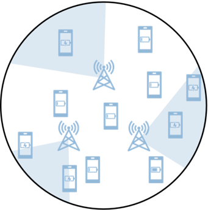

# A MARL Approach to IoT Sensor Charging Efficiency via RF Energy Harvesting and Directional Antennas


The IoT sensors possess monitoring and computational functions, interconnected
 through a network. However, data transmission depletes battery energy. To sustain
 sensor operation, charging is typically done using radio frequency (RF) energy.
 These energy sources, equipped with directional antennas and utilizing energy
 harvesting technology to charge the sensors, need to cooperate to keep the sensors
 in the environment operational. In practical applications, the efficiency of energy
 transmission is affected by the distance between the energy sources and the sensors,
 a concept known as path loss. Considering the above factors, I constructed a
 simulation environment and modeled it as a full-cooperative decentralized partially
 observable Markov decision process (Dec-POMDP) problem. I implemented multi
agent reinforcement learning (MARL) algorithms to provide a decentralized control
 system to manage the energy sources with directional antennas, aiming for optimal
 charging efficiency. I compared the performance of QMIX and Independent Q
learning (IQL) on this problem and analyzed the reasons behind the experimental
 results.
## Build Up
I use pipenv to create virtual environment
```bash
pipenv --python 3.8.10
```
type the following command and dependency can be installed from `Pipfile`
```bash
pipenv install
```
overall, you can directly run with `main.py`
```bash
python main.py
```
